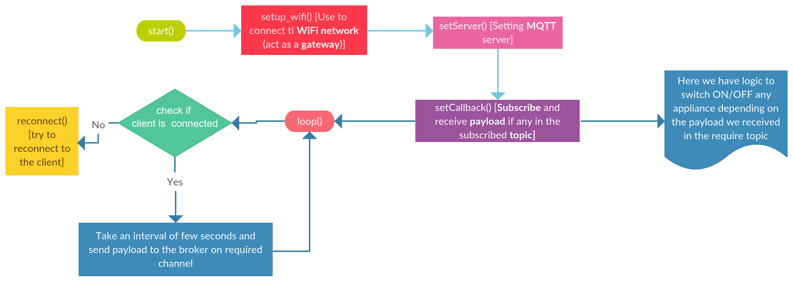

# Road_to_IoT
Collection of Arduino Sketches, I wrote after understanding the basics. Starting from LED blink ("Hello World" for ES) to glowing a bulb through Intranet (using WiFi) to many more...

### Abstract

Nowadays Internet of Things (IoT) has become a very hot topic. We can use it to control objects connected to the *Internet*, thereafter enabling us to *collect and exchange data* between objects. With its expansion in different field out of whcih *Home Automation* is one trend which take us one step ahead toward *smart cities*. In the proposed project(s) a system is developed which is control via *MQTT protocol*, which is a lightweight protocol for IoT. Using which we tried to achieve things like *controlling appliance from distance, generating alerts* based on the data collected. *NodeMCU* is used as a processor connecting different divices via *WiFi* channel. We tried to create a home environment and tested our prototype. First we tried it using HTML web page and then moved to application such as *MQTTBox and *Node-RED dashboard* in later part. 

***

### Designing Idea of the Product

This repository contains 3 Products altogether. Title for each of them is "Home Automation using MQTT", "Visualizing the temperature and humidity using gauge and chart", and "Server room critical temperature notifier".

***

#### Home Automation using MQTT

With coming generation come more busy schedule and this sometime lead to the fact that people forget simple things such as to switch off any appliance which is not in use. So we have made this project. Using this, one can access any electronic appliance in his/her home from anywhere given they have a proper internet connection. To just demostrate this fact the program only demostrate by lighting up a LED using Node-RED. This can also be done using MQTTBox. 

***

#### Visualizing the temperature and humidity using gauge and chart

**Features:**
* Contains switch for 2 lamps.
* Fan can be automated depending on the temperature.
* Visualization of Temperature and Humidity using Gauge and Chart.

***

#### Server room critical temperature notifier

* **The notifier contains three level of notification**

	* When the temperature is above 30 °C [High: Level 1 notification].
	* When the temperature is above 50 °C [Very high: Level 2 notification].
	* When the temperature is above 100 °C [Critical: Level 3 notification].

***

### Hardware required

* [LoLin NodeMCU V3](https://www.amazon.in/Centiot-ESP8266-NodeMCU-Development-Board/dp/B01M98LHT4): It is a Development Kit based on ESP8266, integates GPIO, PWM, IIC, 1-Wire and ADC all in one board. [Documentation](https://nodemcu.readthedocs.io/en/master/)
* [840 Points Bread Board](https://www.amazon.in/Generic-Elementz-Solderless-Piecesb-Circuit/dp/B00MC1CCZQ): Used to temporary prototype.
* LED: Used as a replacement for original electrical appliance.
* [DHT11](https://www.amazon.in/KitsGuru-Module-Temperature-Humidity-Arduino/dp/B00YCF0NMY): Digital temperature and humidity sensor. [Documentation](https://akizukidenshi.com/download/ds/aosong/DHT11.pdf)

***

### Software stack

* [Arduino IDE v1.8.5](https://www.arduino.cc/en/Main/Software)
* [MQTTBox v0.2.1](http://workswithweb.com/mqttbox.html)
* [Node-RED v0.18.4](https://nodered.org/docs/)

***

### Algorithm - Flow Chart 

* **For Home Automation and Visualization of temperature and humidity**

 

Here the NodeMCU is being programmed using Arduino IDE to control the LED. We connected the *ESP8266* to the Wifi using *SSID* and *password* of our home network. Here the WiFi works as a gateway for data transmission. For this we have a function called *setup_wifi()*.

Also the same ESP8266 is used as a MQTT client subcribing to the topic which is used to control the LED (electrical appliance). Here we are using a function called *setCallback()*. If a client is subscribed to a topic, then a *callback function* must be defined which is called when a new message arrive at the client.

After this we enter the *loop* where we check whether we are connected to the client. Basically we are checking if we have a connection with the MQTT broker. If not then we keep retrying else we set an interval (say 2 second). With this interval we publish the temperature and humidity reading to their respective topics. Also if some message is recieve in the subscribed topic then we have a check and depending on the check the LED is turned ON/OFF. This process if continue infinitely.

***

### Node-RED Flow

* **For Home Automation and Visualization of temperature and humidity**

 

* **For Server Room Critical Temperature Notifier**

***

### Demo

* 
* 
* 