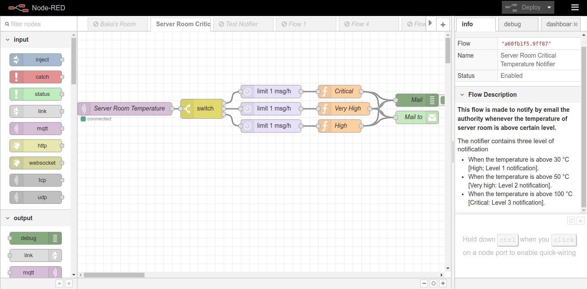

# Road_to_IoT
Collection of Arduino Sketches, I wrote after understanding the basics. Starting from LED blink ("Hello World" for ES) to glowing a bulb through Intranet (using WiFi) to many more...

### Abstract

Nowadays Internet of Things (IoT) has become a very hot topic. We can use it to control objects connected to the *Internet*, thereafter enabling us to *collect and exchange data* between objects. With its expansion in different field out of whcih *Home Automation* is one trend which take us one step ahead toward *smart cities*. In the proposed project(s) a system is developed which is control via *MQTT protocol*, which is a lightweight protocol for IoT. Using which we tried to achieve things like *controlling appliance from distance, generating alerts* based on the data collected. *NodeMCU* is used as a processor connecting different divices via *WiFi* channel. We tried to create a home environment and tested our prototype. First we tried it using HTML web page and then moved to application such as *MQTTBox and *Node-RED dashboard* in later part. 

***

### Designing Idea of the Product

This repository contains 3 Products altogether. Title for each of them is "Home Automation using MQTT", "Visualizing the temperature and Humadity using gauge and chart", and "Server room critical temperature notifier".

***

#### Home Automation using MQTT

With coming generation come more busy schedule and this sometime lead to the fact that people forget simple things such as to switch off any appliance which is not in use. So we have made this project. Using this, one can access any electronic appliance in his/her home from anywhere given they have a proper internet connection. To just demostrate this fact the program only demostrate by lighting up a LED using Node-RED. This can also be done using MQTTBox. 

***

#### Visualizing the temperature and Humadity using gauge and chart

**Features:**
* Contains switch for 2 lamps.
* Fan can be automated depending on the temperature.
* Visualization of Temperature and Humidity using Gauge and Chart.

***

#### Server room critical temperature notifier

* **The notifier contains three level of notification**

	* When the temperature is above 30 °C [High: Level 1 notification].
	* When the temperature is above 50 °C [Very high: Level 2 notification].
	* When the temperature is above 100 °C [Critical: Level 3 notification].

***

### Hardware required

* [LoLin NodeMCU V3](https://www.amazon.in/Centiot-ESP8266-NodeMCU-Development-Board/dp/B01M98LHT4): It is a Development Kit based on ESP8266, integates GPIO, PWM, IIC, 1-Wire and ADC all in one board. [Documentation](https://nodemcu.readthedocs.io/en/master/)
* [840 Points Bread Board](https://www.amazon.in/Generic-Elementz-Solderless-Piecesb-Circuit/dp/B00MC1CCZQ): Used to temporary prototype.
* LED: Used as a replacement for original electrical appliance.
* [DHT11](https://www.amazon.in/KitsGuru-Module-Temperature-Humidity-Arduino/dp/B00YCF0NMY): Digital temperature and humidity sensor. [Documentation](https://akizukidenshi.com/download/ds/aosong/DHT11.pdf)

***

### Software stack

* [Arduino IDE v1.8.5](https://www.arduino.cc/en/Main/Software)
* [MQTTBox v0.2.1](http://workswithweb.com/mqttbox.html)
* [Node-RED v0.18.4](https://nodered.org/docs/)

***

### Algorithm Flow Chart for Home Automation and Visualization of temperature and humadity

 

***

### Node-RED Flow

* **For Home Automation and Visualization of temperature and humadity**

 

* **For Server Room Critical Temperature Notifier**

***

